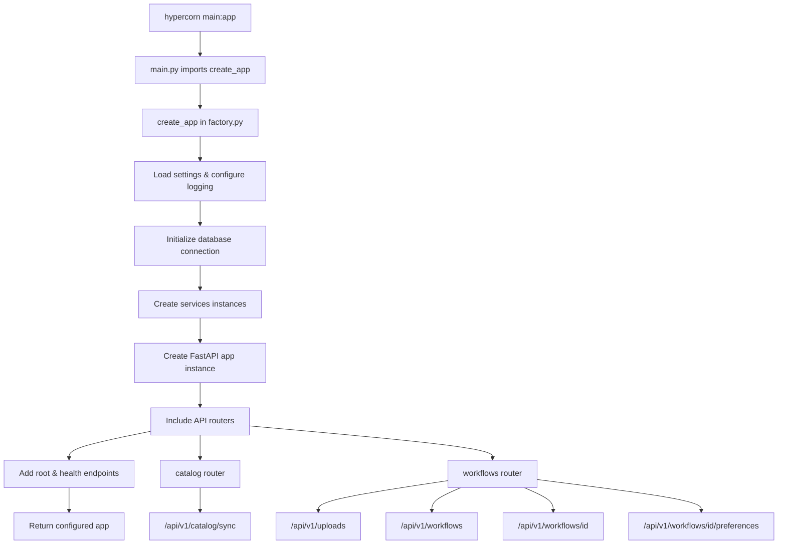
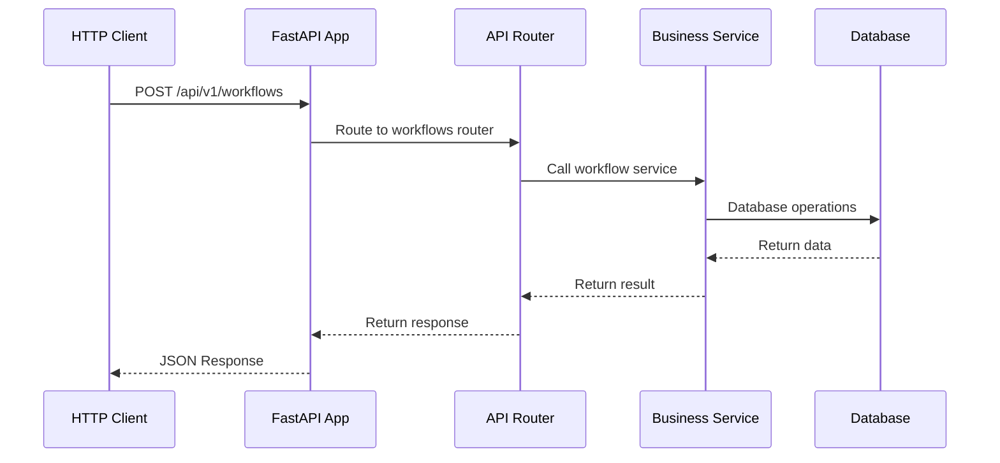

# Application Architecture and Flow

## Overview

This FastAPI application uses the **Factory Pattern** to create and configure the application. While `main.py` only shows one route, it loads all API endpoints through the application factory.

## Application Flow Diagram



## Detailed Flow Breakdown

### 1. Entry Point: `main.py`

```python
import logfire
from src.app import create_app

logfire.configure()
logfire.info('Hello, {name}!', name='world')

app = create_app()  # ← This is where the magic happens!

@app.get("/")
async def root():
    return {"greeting": "Hello, World!", "message": "Welcome to FastAPI!"}
```

**What happens here:**
- Hypercorn loads `main.py` and looks for the `app` object
- `create_app()` is called from `src.app.factory`
- Only one route is defined directly in `main.py` (the root endpoint)
- All other routes are loaded inside the factory


### 1.5 Docker Deployment
This needs to be enshrined, frozen, hung up on the wall or whatever:
```
{
  "$schema": "https://schema.railpack.com",
  "caches": {
    "uv": {
      "directory": "/opt/uv-cache",
      "type": "shared"
    }
  },
  "deploy": {
    "base": {
      "image": "ghcr.io/railwayapp/railpack-runtime:latest"
    },
    "inputs": [
      {
        "include": [
          "/mise/shims",
          "/mise/installs",
          "/usr/local/bin/mise",
          "/etc/mise/config.toml",
          "/root/.local/state/mise",
          ".tool-versions"
        ],
        "step": "packages:mise"
      },
      {
        "include": [
          "/app/.venv"
        ],
        "step": "build"
      }
    ],
    "startCommand": "hypercorn main:app --bind [::]:8080",
    "variables": {
      "PIP_DEFAULT_TIMEOUT": "100",
      "PIP_DISABLE_PIP_VERSION_CHECK": "1",
      "PYTHONDONTWRITEBYTECODE": "1",
      "PYTHONFAULTHANDLER": "1",
      "PYTHONHASHSEED": "random",
      "PYTHONUNBUFFERED": "1"
    }
  },
  "steps": {
    "packages:mise": {
      "assets": {
        "mise.toml": "[tools]\n  [tools.python]\n    version = \"3.13.9\"\n  [tools.uv]\n    version = \"0.9.5\"\n"
      },
      "commands": [
        {
          "path": "/mise/shims"
        },
        {
          "dest": ".tool-versions",
          "src": ".tool-versions"
        },
        {
          "customName": "create mise config",
          "name": "mise.toml",
          "path": "/etc/mise/config.toml"
        },
        {
          "cmd": "sh -c 'mise trust -a && mise install'",
          "customName": "install mise packages: python, uv"
        }
      ],
      "inputs": [
        {
          "image": "ghcr.io/railwayapp/railpack-builder:latest"
        }
      ],
      "variables": {
        "MISE_CACHE_DIR": "/mise/cache",
        "MISE_CONFIG_DIR": "/mise",
        "MISE_DATA_DIR": "/mise",
        "MISE_INSTALLS_DIR": "/mise/installs",
        "MISE_NODE_VERIFY": "false",
        "MISE_SHIMS_DIR": "/mise/shims"
      }
    },
    "install": {
      "caches": [
        "uv"
      ],
      "commands": [
        {
          "dest": "pyproject.toml",
          "src": "pyproject.toml"
        },
        {
          "dest": "uv.lock",
          "src": "uv.lock"
        },
        {
          "path": "/root/.local/bin"
        },
        {
          "path": "/app/.venv/bin"
        },
        {
          "cmd": "uv sync --locked --no-dev --no-install-project"
        }
      ],
      "inputs": [
        {
          "step": "packages:mise"
        }
      ],
      "variables": {
        "PIP_DEFAULT_TIMEOUT": "100",
        "PIP_DISABLE_PIP_VERSION_CHECK": "1",
        "PYTHONDONTWRITEBYTECODE": "1",
        "PYTHONFAULTHANDLER": "1",
        "PYTHONHASHSEED": "random",
        "PYTHONUNBUFFERED": "1",
        "UV_CACHE_DIR": "/opt/uv-cache",
        "UV_COMPILE_BYTECODE": "1",
        "UV_LINK_MODE": "copy",
        "UV_PYTHON_DOWNLOADS": "never",
        "VIRTUAL_ENV": "/app/.venv"
      }
    },
    "build": {
      "commands": [
        {
          "cmd": "uv sync --locked --no-dev --no-editable"
        }
      ],
      "inputs": [
        {
          "step": "install"
        },
        {
          "include": [
            "src/",
            "main.py",
            "pyproject.toml",
            "uv.lock"
          ],
          "local": true
        }
      ]
    }
  }
}
```


### 2. Application Factory: `src/app/factory.py`

```python
def create_app(settings: AppSettings | None = None) -> FastAPI:
    """Create a configured FastAPI instance."""
    
    # 1. Load configuration
    settings = settings or get_settings()
    configure_logging()
    
    # 2. Initialize database and services
    db = Database(settings.database_url)
    workflow_service = WorkflowService.from_settings(settings, db)
    catalog_service = CatalogService.from_settings(settings, db)
    
    # 3. Create FastAPI app
    app = FastAPI(title=settings.app_name, lifespan=lifespan)
    
    # 4. Include API routers ← This loads all endpoints!
    app.include_router(workflows.router, prefix="/api/v1")
    app.include_router(catalog.router, prefix="/api/v1")
    
    # 5. Add health endpoint
    @app.get("/healthz")
    async def health() -> dict[str, Any]:
        return {"status": "ok"}
    
    return app
```

### 3. Router Loading: `src/api/routes/`

The factory imports and includes routers from two main modules:

#### Workflows Router (`src/api/routes/workflows.py`)
```python
router = APIRouter(tags=["workflows"])

@router.post("/uploads")                    # POST /api/v1/uploads
@router.post("/workflows")                  # POST /api/v1/workflows  
@router.get("/workflows/{workflow_id}")     # GET /api/v1/workflows/{id}
@router.post("/workflows/{workflow_id}/preferences")  # POST /api/v1/workflows/{id}/preferences
```

#### Catalog Router (`src/api/routes/catalog.py`)
```python
router = APIRouter(tags=["catalog"])

@router.post("/catalog/sync")               # POST /api/v1/catalog/sync
```

### 4. Complete Endpoint Mapping

| Endpoint       | Method | Path                                          | Source File                   |
| -------------- | ------ | --------------------------------------------- | ----------------------------- |
| Root           | GET    | `/`                                           | `main.py`                     |
| Health         | GET    | `/healthz`                                    | `src/app/factory.py`          |
| Upload Image   | POST   | `/api/v1/uploads`                             | `src/api/routes/workflows.py` |
| Run Workflow   | POST   | `/api/v1/workflows`                           | `src/api/routes/workflows.py` |
| Get Workflow   | GET    | `/api/v1/workflows/{workflow_id}`             | `src/api/routes/workflows.py` |
| Log Preference | POST   | `/api/v1/workflows/{workflow_id}/preferences` | `src/api/routes/workflows.py` |
| Sync Catalog   | POST   | `/api/v1/catalog/sync`                        | `src/api/routes/catalog.py`   |
| Auto Docs      | GET    | `/docs`                                       | FastAPI Auto-generated        |
| OpenAPI Schema | GET    | `/openapi.json`                               | FastAPI Auto-generated        |

## Dependency Injection Flow



## Key Architecture Patterns

### 1. Factory Pattern
- Centralized application creation
- Easy testing with different configurations
- Clean separation of concerns

### 2. Dependency Injection
```python
# Services are injected into route handlers
async def run_workflow(
    *,
    payload: WorkflowRequest,
    workflow_service: Annotated[WorkflowService, Depends(get_workflow_service)],
    db: Annotated[Database, Depends(get_database)],
) -> WorkflowResponse:
```

### 3. Router Organization
- Separate routers for different domains (workflows, catalog)
- Clean URL structure with `/api/v1` prefix
- Automatic OpenAPI documentation generation

## Why You See All Endpoints in `/docs`

FastAPI automatically generates OpenAPI documentation from:

1. **Direct routes** in `main.py` (root endpoint)
2. **Factory routes** in `src/app/factory.py` (health endpoint)
3. **Included routers** from `src/api/routes/` (all API endpoints)
4. **Auto-generated docs** (`/docs`, `/openapi.json`)

The `/docs` endpoint shows all routes because:
- FastAPI scans the entire application object
- All routers are included in the main app
- OpenAPI specification is built from the complete route tree

## File Structure Overview

```
├── main.py                          # Entry point, root route
├── src/
│   ├── app/
│   │   ├── factory.py              # App factory, includes routers
│   │   ├── settings.py             # Configuration
│   │   └── dependencies.py         # Dependency providers
│   ├── api/
│   │   └── routes/
│   │       ├── __init__.py         # Export routers
│   │       ├── catalog.py          # Catalog endpoints
│   │       └── workflows.py        # Workflow endpoints
│   ├── services/                   # Business logic
│   └── db/                         # Database layer
```

This architecture provides a clean, scalable structure where the main entry point stays simple while the factory handles all the complex initialization and routing setup.