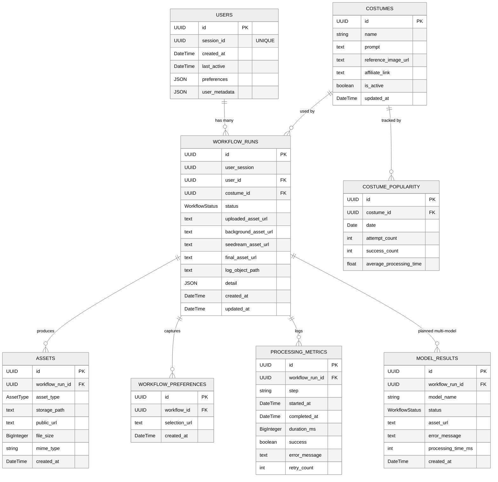
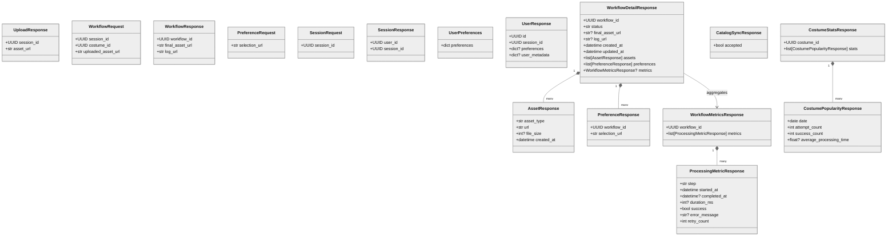

# Data Model Architecture

This document captures the end-to-end data architecture for the waifu-backend-fastapi application, covering database entities, service-layer transfer objects, and the API/UI contracts that the frontend consumes. Each section references a Mermaid diagram saved alongside this document for reuse in design discussions.

## Database Schema Overview
_Source: [`docs/diagrams/database-erd.mermaid`](../diagrams/database-erd.mermaid)_
> **Legend:** ✅ existing  ✳️ planned

The core persistence layer is centred on workflow execution, with supporting tables for assets, metrics, preferences, and catalog analytics. The `model_results` table highlighted below represents the planned expansion required for multi-model output storage.

**Key notes**

- `user_session` keeps anonymous workflows linked even before a `User` record is materialised.
- Asset storage remains denormalised on `workflow_runs` for backward compatibility while `assets` captures detailed metadata.
- `model_results` is modelled now so the migration can be scheduled alongside multi-model execution work.
- Consider adding covering indexes on `workflow_runs.status`, `(assets.workflow_run_id, assets.asset_type)`, and `(costume_popularity.costume_id, costume_popularity.date)` to support analytics queries.

## Service-Layer Models
_Source: [`docs/diagrams/service-layer.mermaid`](../diagrams/service-layer.mermaid)_
> **Legend:** ✅ existing  ✳️ planned

Service classes orchestrate the pipeline and translate ORM entities into lightweight dataclasses consumed by the API layer. Planned DTOs are included to visualise upcoming multi-model orchestration.

```mermaid
%%{init: {'theme': 'neutral'}}%%
%% Source: docs/diagrams/service-layer.mermaid
classDiagram
    class WorkflowService {
        +store_upload(session_id, file) str
        +start_workflow(database, payload) WorkflowState
        +get_workflow(database, workflow_id) WorkflowState?
        +record_preference(database, workflow_id, selection_url) void
    }
    class WorkflowState {
        +UUID workflow_id
        +str final_asset_url
        +str log_url
    }
    class BackgroundRemovalResult {
        +str asset_url
    }
    class SeedreamResult {
        +str asset_url
        +str prompt
    }
    class GoogleGenerationResult {
        +str asset_url
        +str? rationale
    }
    class WorkflowRepository
    class AssetRepository
    class AnalyticsRepository
    class CostumeRepository
    class Database
    class B2Storage
    class BackgroundRemoverClient
    class SeedreamClient
    class GoogleGenerationClient

    WorkflowService --> WorkflowState : returns
    WorkflowService --> BackgroundRemoverClient : uses
    WorkflowService --> SeedreamClient : uses
    WorkflowService --> GoogleGenerationClient : uses
    WorkflowService --> B2Storage : uploads
    WorkflowService --> WorkflowRepository : persists
    WorkflowService --> AssetRepository : planned
    WorkflowService --> AnalyticsRepository : planned
    WorkflowService --> CostumeRepository : reads
    WorkflowService --> Database : sessions
    BackgroundRemoverClient --> BackgroundRemovalResult : yields
    SeedreamClient --> SeedreamResult : yields
    GoogleGenerationClient --> GoogleGenerationResult : yields

    class CatalogService {
        +manual_refresh(database?) int
        +scheduled_refresh() void
    }
    class CatalogItem {
        +UUID id
        +str name
        +str prompt
        +str reference_image_url
        +str? affiliate_link
        +bool is_active
    }
    class CatalogDataSource {
        +fetch() list[CatalogItem]
    }
    CatalogService --> CatalogItem : transforms
    CatalogService --> CatalogDataSource : fetches
    CatalogService --> CostumeRepository : persists
    CatalogService --> AnalyticsRepository : updates metrics
    CatalogService --> Database : sessions

    class AnalyticsService {
        +get_workflow_metrics(workflow_run_id) list[ProcessingMetrics]
        +get_costume_stats(costume_id, start_date, end_date) list[CostumePopularity]
        +get_avg_processing_time(step, workflow_run_id?) float?
    }
    class ProcessingMetrics
    class CostumePopularity

    AnalyticsService --> AnalyticsRepository : queries
    AnalyticsService --> ProcessingMetrics : returns
    AnalyticsService --> CostumePopularity : returns
    AnalyticsService --> Database : sessions

    class UserService {
        +get_by_session(session_id) User?
        +create_or_update(session_id) User
        +update_preferences(user_id, preferences) User?
        +get_by_id(user_id) User?
    }
    class UserRepository
    class User

    UserService --> UserRepository : delegates
    UserService --> Database : sessions
    UserService --> User : returns

    class AssetUploadRequest {
        +UUID session_id
        +bytes file_data
        +str filename
        +str content_type
        +str storage_prefix="uploads"
    }
    class WorkflowExecutionContext {
        +UUID workflow_id
        +CatalogItem costume
        +UUID user_session
        +str uploaded_url
        +str? background_url
        +dict[str, str] model_results
        +list[str] errors
    }
    class AnalyticsSnapshot {
        +UUID costume_id
        +int total_attempts
        +float success_rate
        +float avg_processing_time_ms
        +(date, date) date_range
    }

    %% Classes below capture planned DTOs for upcoming multi-model orchestration and analytics enhancements.
```

**Highlights**

- `WorkflowState` is the existing response DTO; `WorkflowExecutionContext` and `AssetUploadRequest` are earmarked for the multi-model enhancement to keep orchestration deterministic.
- `CatalogService` writes through to the repository using dataclass conversion, keeping ORM models isolated.
- Analytics flows return ORM instances today; `AnalyticsSnapshot` clarifies the target aggregate structure for future reporting endpoints.

## API & UI Contract Models

Pydantic models mediate the API boundary. Current contracts cover uploads, workflow execution, analytics, and user preferences, while the planned `WorkflowDetailResponse` brings richer payloads to the UI.

**Contract guidance**

- Prefer camelCase aliases when exposing these models to the frontend; apply `ConfigDict(populate_by_name=True, alias_generator=to_camel)` when introducing the planned schemas.
- Keep internal identifiers (`user_id`, `workflow_id`) as UUID strings in responses; clients already handle UUID parsing.
- `WorkflowDetailResponse` will become the canonical payload for detail screens once model results and assets are persisted individually.

## Cross-layer Transformation Flow

1. Clients submit `WorkflowRequest` alongside an uploaded asset reference.
2. `WorkflowService.start_workflow` orchestrates Background Remover → Seedream → Google clients, producing intermediary results stored via `AssetRepository` (planned) and persisted as `WorkflowRun`/`ModelResult` records.
3. Analytics hooks (`ProcessingMetrics`, `CostumePopularity`) capture timing and aggregated statistics for reporting endpoints.
4. Responses surface as `WorkflowResponse` (today) or the richer `WorkflowDetailResponse` (planned), using `WorkflowState` as the service DTO boundary.

## Mutability Matrix

| Layer            | Entity / DTO            | Mutability Strategy | Notes |
|------------------|-------------------------|---------------------|-------|
| Database         | `WorkflowRun`, `Asset`, `ProcessingMetrics`, `WorkflowPreference`, `ModelResult` | Append-only / state transitions | Preserve auditability; status changes follow pending → completed/failed transitions. |
| Database         | `User`, `Costume`, `CostumePopularity` | Mutable | Supports session refresh, catalog updates, and rolling analytics. |
| Service DTOs     | `WorkflowState`, `CatalogItem`, `BackgroundRemovalResult` | Immutable dataclasses | Returned to API layer without ORM coupling. |
| UI Models        | Pydantic request/response models | Immutable once serialised | Validation occurs at the boundary; prefer explicit enums and URLs. |

## Next Steps & Alignment

- Schedule an Alembic migration to introduce `model_results` and backfill existing `final_asset_url` values.
- Extract service-layer DTOs into `src/services/dtos/` to formalise typing, mirroring the planned classes in the diagrams.
- Introduce `src/api/schemas/` for the camelCase API models and wire them into the FastAPI routes to decouple the UI layer from internal dataclasses.
- Update repository methods to persist per-model assets, enabling the UI to render the richer `WorkflowDetailResponse` structure.

With the diagrams and narrative above, the data model now captures the current implementation and the forward-looking changes required for multi-model orchestration and UI enrichment.
